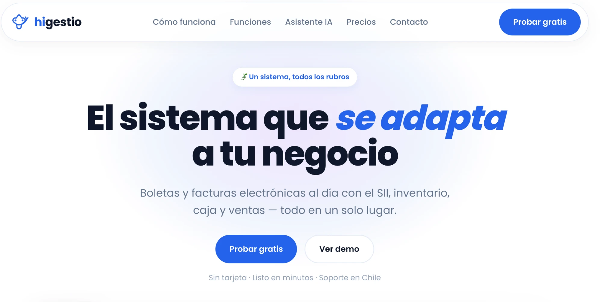
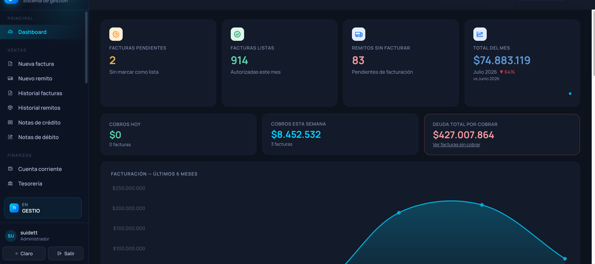
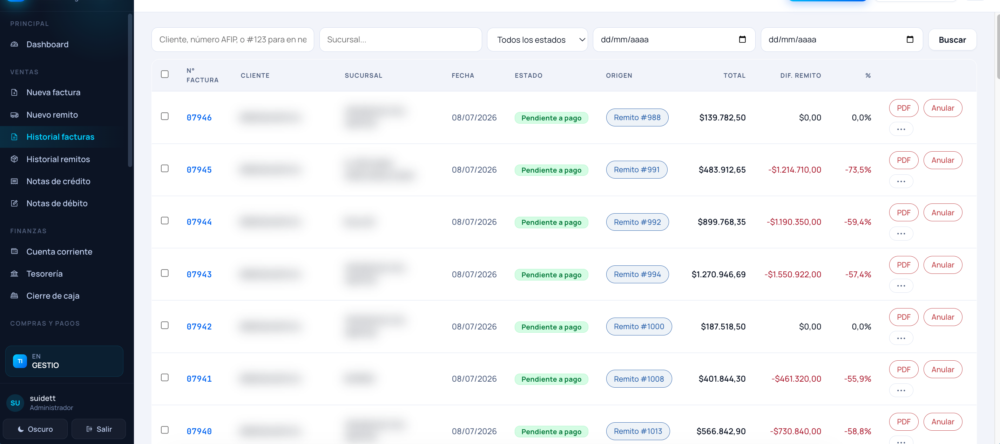
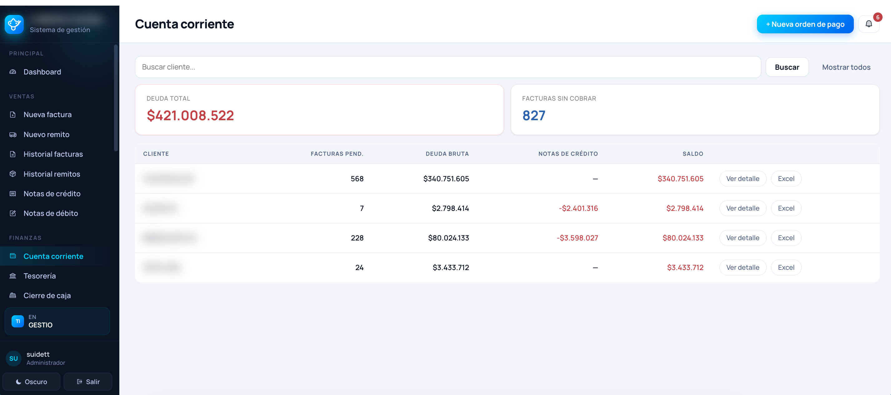
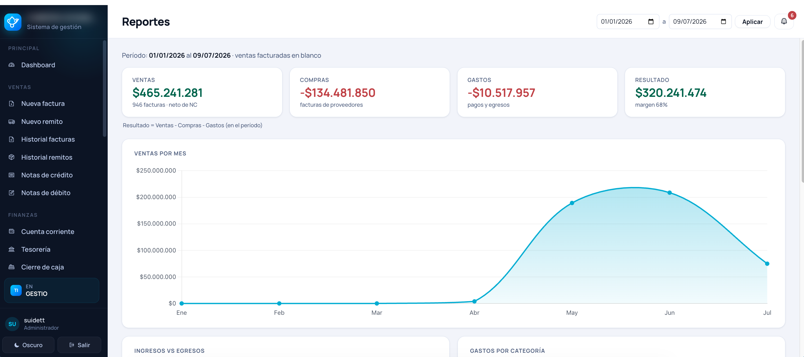
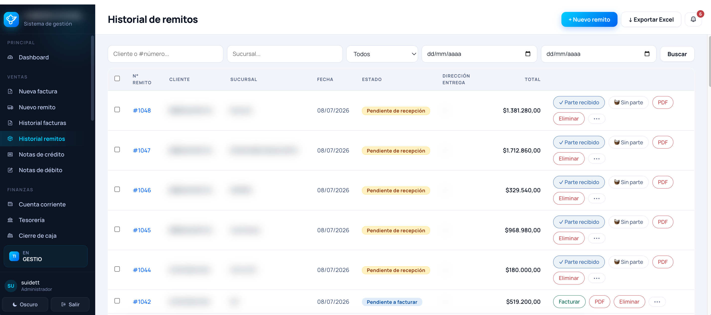
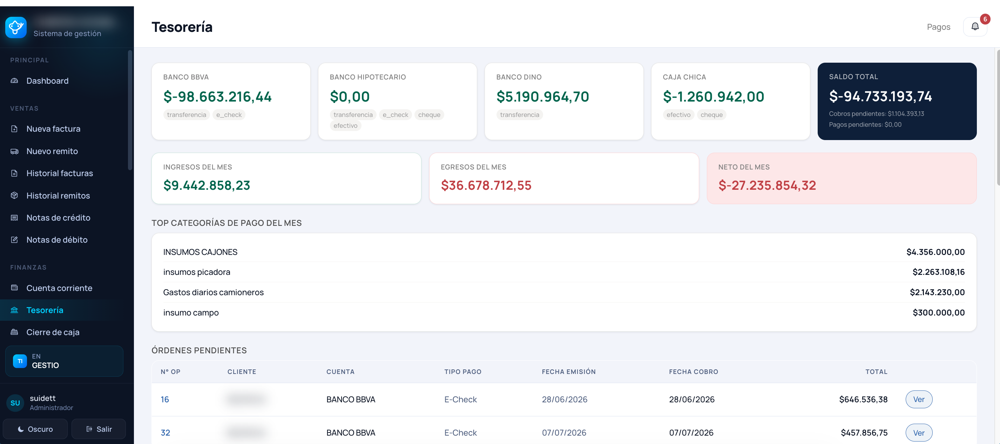
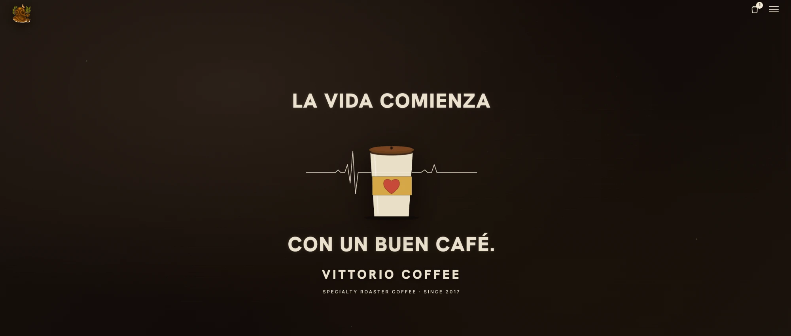

<!-- HEADER BANNER -->

  

<!-- ANIMATED TAGLINE -->

  

  
  
  
  
  
  

  
  
  

---

## 👋 About me · Sobre mí

**EN** — Full-stack developer focused on **backend and business systems**. I design and ship
production software: multi-tenant SaaS, invoicing with PDF generation, inventory & management
systems, REST APIs, web scraping and automations. Clean architecture, data isolation, and things
that **actually work**.

**ES** — Desarrollador full-stack enfocado en **backend y sistemas de negocio**. Diseño y llevo a
producción software real: SaaS multi-tenant, facturación con PDF, gestión e inventario, APIs REST,
scraping y automatizaciones. Arquitectura limpia, aislamiento de datos y cosas que **funcionan de verdad**.

---

## 🚀 Featured — SaaS platform · Plataforma SaaS

### 🌐 Higestio — Multi-tenant SaaS · [higestio.com](https://higestio.com) &nbsp;✅ **live**

**EN** — A **live multi-tenant SaaS**: any business signs up and gets its own workspace
(subdomain + isolated database) for **electronic invoicing (Chile · SII)**, inventory, POS,
treasury and sales — all in one place. 
**ES** — **SaaS multi-tenant en vivo**: cada negocio se registra y obtiene su propio espacio
(subdominio + base aislada) para **boletas/facturas electrónicas (SII)**, inventario, caja y
ventas — todo en un solo lugar.

> 🚀 **10+ businesses onboarded in its first phase** · **+10 clientes reales en su primera fase.**

  

<a href="https://higestio.com"><b>🔗 higestio.com — probar en vivo</b></a>

---

### 🏢 Gestio — the system in production (a real tenant of Higestio)

**EN** — A full management & invoicing platform for distribution businesses: invoicing
(facturas & boletas), delivery notes (remitos), credit/debit notes, accounts receivable,
treasury with daily cash-close, expenses and analytics. **Running in production** for a real
business — and also built as a **multi-tenant SaaS** (a PostgreSQL schema per company with
subdomain routing).

**ES** — Plataforma completa de gestión y facturación para negocios de distribución: facturación,
remitos, notas de crédito/débito, cuenta corriente, tesorería con cierre de caja, gastos y
reportes. **En producción** para un negocio real — y construida además como **SaaS multi-tenant**
(un schema de PostgreSQL por empresa, con ruteo por subdominio).

**Highlights**
- 🧾 Invoicing, delivery notes & credit/debit notes · 💰 accounts receivable
- 🏦 Treasury + daily cash-close · 📊 real-time dashboards & reports
- 🔒 Multi-tenant — a PostgreSQL **schema per company** (`django-tenants`) + subdomain routing
- ⚙️ Production-ready: Docker · Gunicorn · WeasyPrint (PDF) · Sentry

  <code>Python</code> · <code>Django</code> · <code>django-tenants</code> · <code>PostgreSQL</code> · <code>WeasyPrint</code> · <code>Docker</code>

  
  

  
  

> Real production system — **client names blurred for privacy**; real amounts and charts kept. 
> *Sistema real en producción — nombres de clientes difuminados por privacidad.*

<b>📸 More modules · Más módulos</b>

 

  
  

Delivery notes (remitos) · treasury with bank balances & cash-close.

> 🔒 Deployed as several instances (single-business & multi-tenant SaaS). Source is private —
> happy to walk through the code & architecture. · Desplegado en varias instancias; código privado,
> con gusto muestro el código y la arquitectura.

---

### ☕ Vittorio Coffee — Coffee-shop e-commerce

**EN** — E-commerce storefront for a specialty coffee roaster (*since 2017*): landing, product
catalog, cart & checkout. 
**ES** — Tienda online (e-commerce) para una cafetería de especialidad: landing, catálogo de
productos, carrito y checkout.

<code>React</code> · <code>TypeScript</code>

---

## 🛠️ What I can help you with · En qué te puedo ayudar

| Area · Área | Tech |
|---|---|
| Backend & REST APIs | Django · FastAPI · Node/Express |
| Web apps & dashboards | React + Django/Python |
| Web scraping & data | Python · Playwright · BeautifulSoup |
| Automation & bots · Automatización | API integrations · Telegram/Discord bots |
| Databases · Bases de datos | PostgreSQL · MongoDB · MySQL |

---

  

<i>Let's build something that ships. · Construyamos algo que salga a producción.</i>

